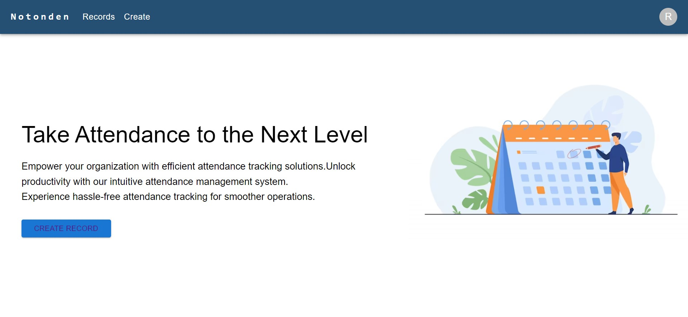

# Notonden

### Objective:
Develop a full-stack web application for managing attendance records using
JavaScript technologies including Node.js, Express, and React.

### Project Live Link:
https://notonden.netlify.app/

### Backend Link
https://notonden.onrender.com

### Frontend
The frontend of this project is built using React.js along with Material-UI for UI components. Redux is used for state management.

#### Technologies Used
- React.js
- Material-UI
- Redux
- React Router
- Axios
- Day.js
- react-redux
- react-router-dom

### Backend
The backend of this project is built using Node.js with Express.js as the web application framework. MongoDB is used as the database with Mongoose as the ODM (Object Data Modeling) library. JSON Web Token (JWT) is used for authentication.

- Technologies Used
- Node.js
- Express.js
- MongoDB
- Mongoose
- JSON Web Token (JWT)
- Dependencies
- express
- mongoose
- cors
- jsonwebtoken
- crypto-js
- dotenv
- nodemon

Color Template: https://colorhunt.co/palette/2650732d95969ad0c2f1fada

